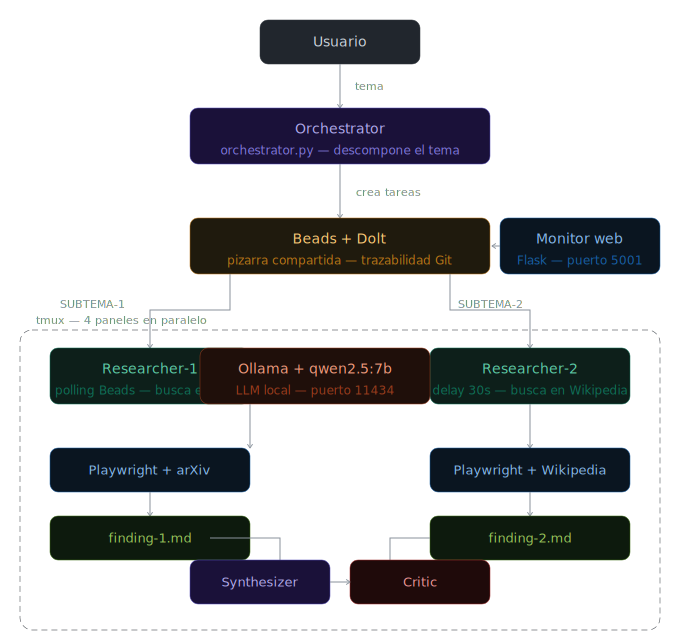

# Research Engine Distribuido

Sistema multiagente de investigación (LLM en local con OLLAMA)

Este es el primer proyecto de una serie de proyecto que tienen como objetivo la investigación en el campo de Agentes

En este primer proyecto se pretende solucionar un problema no deterministico mediante el uso de agentes.

## Stack
- **Ollama + qwen2.5:7b** — LLM local (sin coste).Ollama es una herramienta de código abierto diseñada para ejecutar Grandes Modelos de Lenguaje (LLMs) como Llama 3, Mistral o Gemma directamente en tu ordenador (localmente), sin depender de la nube. 
- **Beads + Dolt** — coordinación y trazabilidad entre agentes. Dolt es una base de datos SQL relacional que permite el control de versiones de los datos y esquemas de manera similar a como Git gestiona el código fuente. Se describe frecuentemente como "Git para datos"
- **Playwright** — Los agentes de investigación buscan en web real (arXiv, Wikipedia)
- **tmux** — Para lanzar y ver terminales de ejecución paralela de agentes. Usa ctl+b y luego la flecha para desplazarte
- **Flask** — Usado para el dashboard de monitorización en tiempo real

## Agentes
| Agente | Rol |
|---|---|
| Orchestrator | Descompone el tema de investigación en subtemas y crea tareas en Beads |
| Researcher-1 | Investiga subtema 1 con búsqueda web real |
| Researcher-2 | Investiga subtema 2 con búsqueda web real |
| Synthesizer | Consolida los hallazgos en un informe final |
| Critic | Evalúa la calidad del informe y detecta sesgos |

## Arranque
\`\`\`bash
cd research-engine && ./start.sh
\`\`\`

## Requisitos
- WSL2 + Ubuntu ( Ejecutado en la instancia linux de Windows)
- Python 3.10+
- Node.js 20+
- Go 1.24+ 
- Ollama (Proxy para los LLM que se usan)

## Arquitectura

Ver diagrama interactivo: [docs/architecture.html](docs/architecture.html)
